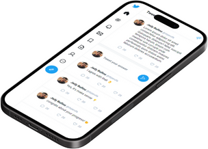

Here's an enhanced README for your project that includes the additional technologies and a section for screenshots:

---

# UI Twitter Replica

This project recreates the Twitter timeline interface, designed to be responsive and familiar to users of the popular social media platform. 🎯

## Technologies Used 👨🏻‍💻:

- **React**: For building a dynamic and interactive UI resembling the Twitter timeline.
- **React Router DOM**: To manage navigation within the application, simulating the seamless user experience of Twitter.
- **TypeScript**: Adds static type definitions to JavaScript for more robust and error-resistant code.
- **Vite**: A modern build tool providing fast development with Hot Module Replacement (HMR).
- **ESLint**: Ensures code quality with static analysis and linting.
- **npm**: Utilized as a package manager to organize and manage project dependencies.
- **Responsive Design**: Ensures that the application's interface adapts to various screen sizes and devices, maintaining usability and aesthetics.

## Language Distribution 📝:

- TypeScript: 53.7%
- CSS: 37.4%
- HTML: 5.3%
- JavaScript: 3.6%

## Screenshots 📷:

